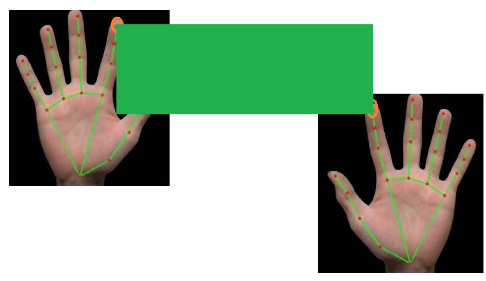
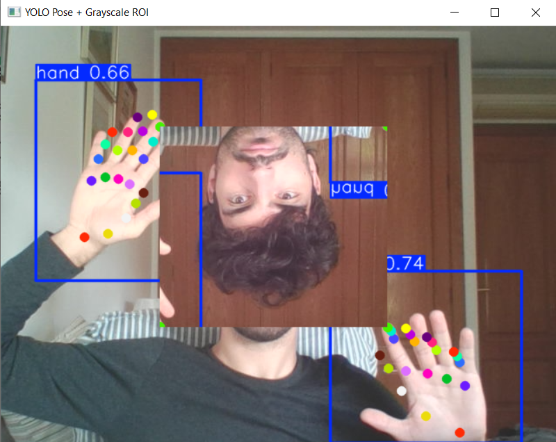

# Real-Time Hand-Keypoint AR

A custom-trained pose model that detects hands, estimates 21 landmarks per hand, and uses the
fingertip positions to define an on-screen region where a live image effect is applied, all
running in real time from a webcam.

| Concept | Live result |
| --- | --- |
|  |  |

*Left: the two index fingers define the corners of a rectangular region. Right: the region
between both hands is captured live and re-rendered with an effect applied.*

## Approach

A YOLO11 pose model (pretrained on COCO body keypoints) is fine-tuned on the 26.7k-image
Ultralytics hand-keypoints dataset to specialize it for hand landmarks. Two configurations
were trained and compared: a nano model (640 px, 100 epochs) and a medium model (320 px,
50 epochs), trading accuracy against real-time speed on modest hardware (a single GTX 1050
Ti). The detected index-fingertip landmarks are then used to define a rectangular ROI whose
contents are re-rendered live with an effect.

## Result

The fine-tuned model reaches **mAP@50 ≈ 0.88** on pose keypoints (up from ~0.14 before
training) and runs in real time, with the nano model giving the best speed/quality balance
for live use. It tracks open palms robustly and degrades gracefully on strongly deformed
hand shapes.

## Tech stack

Python · Ultralytics YOLO11 (pose) · OpenCV · NumPy · Jupyter

## Repository layout

```
hand_keypoint_pose.ipynb   training configs, metrics and live inference
yolo_project/              goal illustration, dataset sample and result frames
results.csv                per-epoch training metrics
assets/                    poster and result media
```

Model weights (`*.pt`) and the training dataset are kept out of version control, see
`.gitignore`.
